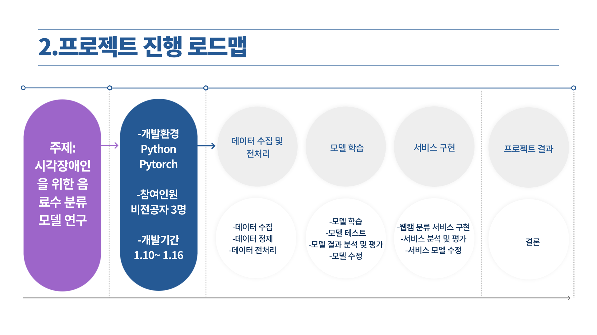
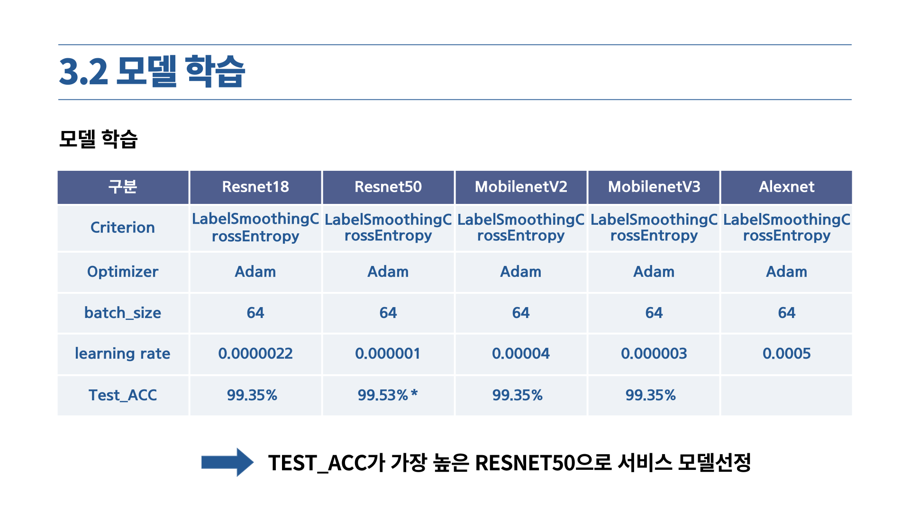
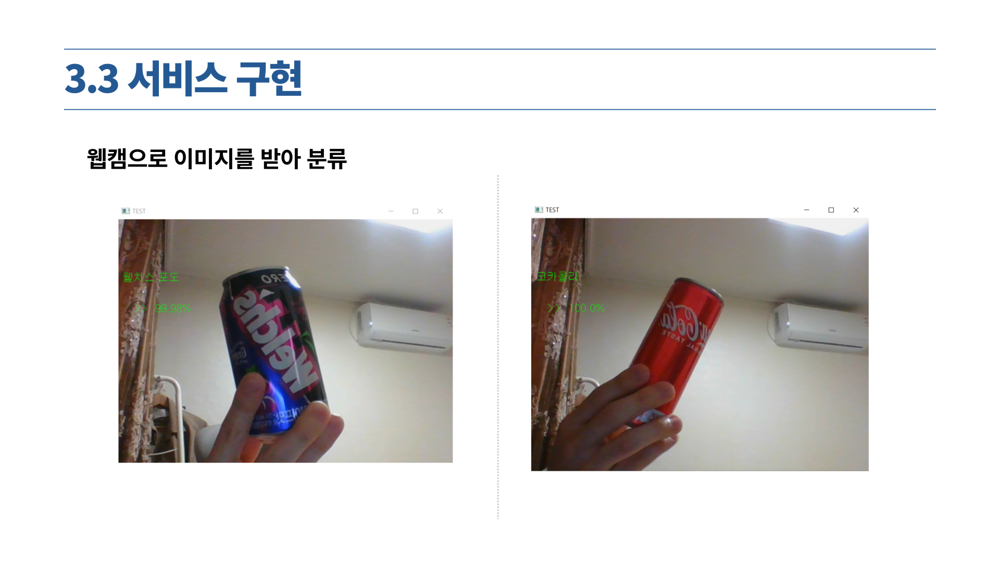

# Beverage_Classification_Project
시각장애인을 위한 음료수 분류 AI 서비스 프로젝트

1.목표
-------------
1. 음료수를 이미지 분류
2. 웹캠에 학습된 모델을 적용
3. 분류된 결과를 TTS로 소리 변환

2.프로젝트로드맵
-------------

3.모델 학습 결과
-------------

4.서비스 구현
-------------

